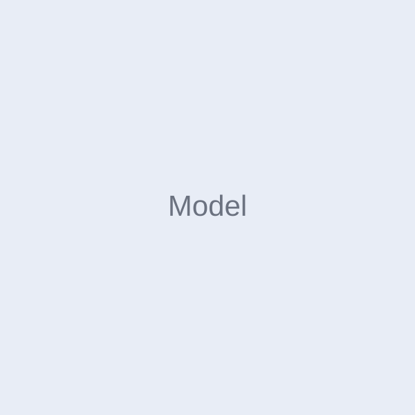

# XKPrint — 模型相关模块层级结构

> 来源:`index.html`(共 1122 行),提取其中与「模型」相关的 DOM 层级。

## 1. 模型 Panel(我的模型)

```html
<section data-page="models" class="page active">
├── <header class="page-header">
│   └── <h2>我的模型</h2>
├── <div class="filter-row">                      <!-- 筛选 chips -->
│   ├── <button class="chip active">全部</button>
│   └── <button class="chip">已收藏</button>
└── <div class="model-grid" aria-label="我的模型">  <!-- 模型网格 -->
    └── <article class="model-card" data-model-card …> × 4
        ├── <button class="model-card__open" type="button" data-model-open>
        │   ├── 
        │   └── <span class="model-card__summary">
        │       ├── <strong>模型名.3mf</strong>
        │       └── <span>作者 · Kai</span>
        └── <button class="favorite-button" type="button" data-favorite aria-pressed="false">
```

**卡片 `data-*` 属性(数据来源):**

| 属性 | 示例值 |
|---|---|
| `data-model-title` | 螺旋花器.3mf |
| `data-model-author` | Kai |
| `data-model-format` | 3MF / STL |
| `data-model-size` | 98 × 98 × 180 mm |
| `data-model-estimate` | 约 5 小时 28 分钟 · 128 g |
| `data-model-status` | 正在打印 / 可打印 / 待切片 |
| `data-model-description` | 模型简介文案 |

**交互钩子:**`data-model-open`(打开详情)、`data-favorite`(收藏切换)、`data-model-card`(卡片容器)。

## 2. 商城 Panel(模型商城)

```html
<section data-page="market" class="page">
├── <header class="page-header">
│   └── <h2>模型商城</h2>
├── <div class="search-field">                    <!-- 搜索(占位,非输入框) -->
│   ├── <i data-lucide="search" class="search-icon"></i>
│   └── <span class="search-placeholder">搜索模型...</span>
├── <div class="category-row">                    <!-- 分类 chips -->
│   ├── <button class="chip active">精选</button>
│   ├── <button class="chip">家居</button>
│   ├── <button class="chip">玩具</button>
│   └── <button class="chip">工具</button>
└── <div class="market-grid" aria-label="商城模型">
    └── <article class="market-item" data-model-card …> × 4
        ├── <button class="model-card__open" type="button" data-model-open>
        │   ├── 
        │   └── <span class="model-card__summary">
        │       ├── <strong>折纸氛围灯</strong>
        │       └── <span>作者 · XK Official</span>
        └── <button class="favorite-button" type="button" data-favorite aria-pressed="false">
```

> 结构与模型卡片一致,复用 `data-model-*` 属性;`data-model-status` 此处承载「¥12 · 2.4k 下载」等价格/下载信息。

## 3. 模型详情 Panel(子页面)

```html
<section data-page="model-detail" class="page model-detail-page">
├── <header class="page-header subpage-header">
│   ├── <button class="icon-btn" type="button" data-model-detail-back>   ← 返回
│   ├── <h2>模型详情</h2>
│   └── <span class="header-spacer" aria-hidden="true"></span>
├── <div class="model-detail-page__image-wrap">
│   └── 
├── <article class="model-detail-page__hero">
│   ├── <div class="model-detail-page__hero-copy">
│   │   ├── <h1 data-model-detail-title></h1>
│   │   └── <p data-model-detail-author></p>
│   └── <button class="btn btn-primary model-detail-page__print-button" data-model-detail-print>
│       ├── <i data-lucide="printer"></i>
│       └── <span>开始打印</span>
└── <article class="model-detail-page__content">
    ├── <h3>简介</h3>
    ├── <p data-model-detail-description></p>
    └── <dl class="model-detail-page__facts">
        ├── <div><dt>文件格式</dt><dd data-model-detail-format></dd></div>
        ├── <div><dt>模型尺寸</dt><dd data-model-detail-size></dd></div>
        ├── <div><dt>打印估算</dt><dd data-model-detail-estimate></dd></div>
        └── <div><dt>当前状态</dt><dd data-model-detail-status></dd></div>
    </dl>
</section>
```

**详情页数据钩子:**`data-model-detail-title / author / description / format / size / estimate / status / image`(由卡片 `data-model-*` 填充),交互钩子:`data-model-detail-back`、`data-model-detail-print`。

## 4. 文件 Panel 中的模型文件列表(相关)

```html
<section data-page="files" class="page file-browser-page">
└── <div class="file-list-heading">
    ├── <div><h3>模型文件</h3><span>4 个文件</span></div>
    └── <button class="file-sort-button">… 最近使用</button>
    └── <div class="print-file-list">
        └── <article class="print-file-card"> × 4
            ├── <div class="print-file-thumb spiral-vase"></div>
            ├── <div class="print-file-info">
            │   ├── <div class="print-file-title">
            │   │   ├── <strong>螺旋花器.3mf</strong>
            │   │   └── <span class="file-ready-dot"></span>   ← 就绪指示
            │   ├── <p>98 × 98 × 180 mm · 128 g</p>
            │   └── <div>
            │       ├── <span class="tag">3MF</span>
            │       ├── <span><i data-lucide="clock-3"></i> 5h 28m</span>
            │       └── <time>今天 10:24</time>
            └── <button class="print-file-more"> … <i data-lucide="ellipsis-vertical"></i></button>
    </div>
```

## 5. 底部导航入口

```html
<nav class="bottom-nav">
    └── <button data-nav="models" class="nav-item active">   ← 模型 Tab
        ├── <i data-lucide="package"></i>
        └── <span>模型</span>
```

## 6. 其他关联点(散落引用)

- 「我的」页 profile 指标:标签「模型」,数值 `23`。
- 「设置」页缓存明细:`模型预览数据 42.1 MB`。
- FAQ 条目:「模型打印时出现翘边如何处理?」(`data-help-faq data-help-keywords="打印 失败 翘边 热床 首层 模型"`)。
- 用户条款/注销提示中提及「模型浏览」「收藏模型」。
- 相关样式文件:`styles-models.css`、`styles-market.css`、`styles-files.css`。

## 数据流小结

```
model-card(data-model-* 静态数据)
   └─ data-model-open 点击 ──> 填充 model-detail 各 data-model-detail-* 节点
        └─ data-model-detail-print 开始打印 ──> 打印任务流
data-favorite(收藏) 与 data-nav="models" 均由 app.js 控制切换
```
